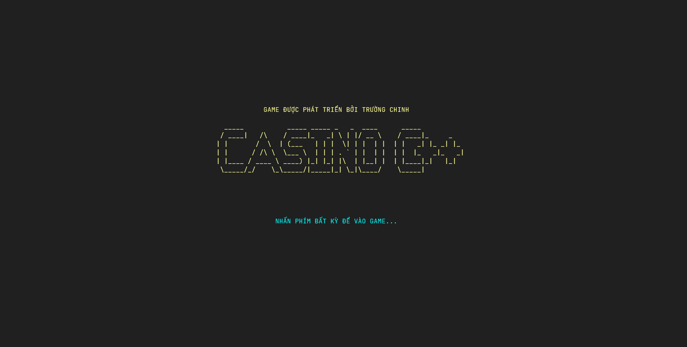

<p align="center">
  <a href="https://en.cppreference.com/w/cpp/17">
    
  </a>
  <a href="https://github.com/trgchinhh/casinogame-cpp">
    
  </a>
  <a href="LICENSE">
    
  </a>
  <a href="https://github.com/trgchinhh">
    
  </a>
</p>


## CASINO GAME C++

**Casino Game C++** là một dự án game cá cược chạy trên môi trường dòng lệnh (custom TUI), được phát triển bằng ngôn ngữ **C++ (C++14+)**. Dự án mô phỏng nhiều trò chơi cá cược quen thuộc với giao diện ASCII trực quan, hiệu ứng màu sắc và âm thanh, có tích hợp AI, mang lại trải nghiệm sinh động ngay trong terminal.

<!--
---


## Số sao
<a href="https://www.star-history.com/?repos=trgchinhh%2Fcasinogame-cpp&type=date&legend=bottom-right">
 <picture>
   <source media="(prefers-color-scheme: dark)" srcset="https://api.star-history.com/chart?repos=trgchinhh/casinogame-cpp&type=date&theme=dark&legend=bottom-right&sealed_token=PN0boDw7w5Qh7BLq25Vu4jM4A1344kbkLt_iKZ264i0p6nGR5gob0kqIPkb1KU-t2s1eqAKrDy_hwusXjZ1vtWM5Hhks-jRVOaET_L0nLzrBXqWHKU2L-6WLPEV3o4_Z3j9nBX1hhUs0pkdk2pn4cBZKeCytvrQfPEUkhLkTcECBiY89h4V54qpJ5AYOJru5hYwvYDKbYBvvNJ6OBIwPX78ipChaCg_rX43qymsoWWruK7do4YfJvXWTny-gfaCb_hlzAdzXig-z8YvssgFoqk_xCJ2Q4_74ybx1A45s9vZYjbFOpX45zKHPQZcppIB9zjb-EigPaLCS44zC4UFzqVDZWTT7fpt3wyDRISk6_UgByosTu9i8L2yKXIAiUSrnkpvTCAMfUAPAr-HPgztTo2qFHPhekWY9GmKoMBQUjGIr89LLzAQWXVIIyf2udX-aAl4soGCIn2FIQrdMNrv3Hg8DgmnB0z495QjbO7Qop7qAgxgMPOuBfjmksV1q-T8l6OBrplTbI9DRdQsmpjmJSx3YQJmos3wyGExR1yhIcga-gA5TOa9Ov_FLKaED8pAWIT5aTMAEAle_GV1CUERAwYERFEiZMtmpZFpD8EbgJ6RnkgG1bR3p1iGKxMQ-ClosQ8W8OuTBmQiJMrth04ivrjfFEyZn8AKLyZzQujB4M-TWJVfF9DjSmSh5p9AZFIuK4IwNV7Gp9Zx2oHofx6RHBwK6rNHB3RDvL4kXMi4RZIfzgnRQhDl0yoCzy06qujYXIK81kjZyoAI-gSMluAPK-AH7EXihvrYSTHx4w0wgNfzicycXFiU7-EiuF_2t_lW_LDxxf5smKtRLFJBK2E7bTER_9ET6AzT0LgU2ibAYoy6oHuCvIyS6xVa6UZVwCcipYy5hxfPagyhhVazlkyKYixUpe7s8nHLf9vABuySpJ8dZFA2gIcvr1XWsP9j9GaLfF8r_IUh9Umzf1j_5-cUKdiA0ax5KbOQ8J4PlM8udCNIb8-SjjCSZZUUP0Ak1i2tfkTU_otBkgsXBqJkoZkJoCAACGK5CjE1NKzk2hZ-OXI5C-ggOVAHN3Md9CHC6w1AwQMFQMNzxC3IVpcfHLv1dNagokioHbqFGpe4-Glh-muydss5CxsGStTWBAAMOOuXgt2TH3FYv4ohrbCkrPt8uNwFMOo5mDjAe5IbA6UX7DxUi7gdKB0j61KD9JBi24eD5brGf3xX6hd5p9SKlDgk8zdyFNW80yj6z9Ofg9u-TO16nz1-lVMLun2RSONPGdIwXdjr0QFvRTGW_lzn-6kRMfgzq95k4kPWjPJaAqUDLjTAUYcHPxqVZosIegA7AI9-Ov5YYsIWCWK5G3su0pJzNaZuQoBn5y5BI5FK2fIZWn29nhVtolkgaWdOB1yKadrXD7qN9NmdD9cP5hZQVgi2kzEX2TkeMT7s-vQZvrCQVpnVXh0FamewNcUspRIgtdXL8mSy9nOiATOqWd_9m9tvJdU-2pQBdVJkLvUzUZSQmgPUMF3xPY2nmQSVwv6IsSEoGQFv5cYFDWAz5EElh9AcweXFEPWUryV2zTdHbeAWK6aNGuvL-BmlBdgHFpSgmPe-aUVeI-EZ50uzic2oPj9Sa-LoCzCO4k_OGDd_MHhPcCA" />
   <source media="(prefers-color-scheme: light)" srcset="https://api.star-history.com/chart?repos=trgchinhh/casinogame-cpp&type=date&legend=bottom-right&sealed_token=PN0boDw7w5Qh7BLq25Vu4jM4A1344kbkLt_iKZ264i0p6nGR5gob0kqIPkb1KU-t2s1eqAKrDy_hwusXjZ1vtWM5Hhks-jRVOaET_L0nLzrBXqWHKU2L-6WLPEV3o4_Z3j9nBX1hhUs0pkdk2pn4cBZKeCytvrQfPEUkhLkTcECBiY89h4V54qpJ5AYOJru5hYwvYDKbYBvvNJ6OBIwPX78ipChaCg_rX43qymsoWWruK7do4YfJvXWTny-gfaCb_hlzAdzXig-z8YvssgFoqk_xCJ2Q4_74ybx1A45s9vZYjbFOpX45zKHPQZcppIB9zjb-EigPaLCS44zC4UFzqVDZWTT7fpt3wyDRISk6_UgByosTu9i8L2yKXIAiUSrnkpvTCAMfUAPAr-HPgztTo2qFHPhekWY9GmKoMBQUjGIr89LLzAQWXVIIyf2udX-aAl4soGCIn2FIQrdMNrv3Hg8DgmnB0z495QjbO7Qop7qAgxgMPOuBfjmksV1q-T8l6OBrplTbI9DRdQsmpjmJSx3YQJmos3wyGExR1yhIcga-gA5TOa9Ov_FLKaED8pAWIT5aTMAEAle_GV1CUERAwYERFEiZMtmpZFpD8EbgJ6RnkgG1bR3p1iGKxMQ-ClosQ8W8OuTBmQiJMrth04ivrjfFEyZn8AKLyZzQujB4M-TWJVfF9DjSmSh5p9AZFIuK4IwNV7Gp9Zx2oHofx6RHBwK6rNHB3RDvL4kXMi4RZIfzgnRQhDl0yoCzy06qujYXIK81kjZyoAI-gSMluAPK-AH7EXihvrYSTHx4w0wgNfzicycXFiU7-EiuF_2t_lW_LDxxf5smKtRLFJBK2E7bTER_9ET6AzT0LgU2ibAYoy6oHuCvIyS6xVa6UZVwCcipYy5hxfPagyhhVazlkyKYixUpe7s8nHLf9vABuySpJ8dZFA2gIcvr1XWsP9j9GaLfF8r_IUh9Umzf1j_5-cUKdiA0ax5KbOQ8J4PlM8udCNIb8-SjjCSZZUUP0Ak1i2tfkTU_otBkgsXBqJkoZkJoCAACGK5CjE1NKzk2hZ-OXI5C-ggOVAHN3Md9CHC6w1AwQMFQMNzxC3IVpcfHLv1dNagokioHbqFGpe4-Glh-muydss5CxsGStTWBAAMOOuXgt2TH3FYv4ohrbCkrPt8uNwFMOo5mDjAe5IbA6UX7DxUi7gdKB0j61KD9JBi24eD5brGf3xX6hd5p9SKlDgk8zdyFNW80yj6z9Ofg9u-TO16nz1-lVMLun2RSONPGdIwXdjr0QFvRTGW_lzn-6kRMfgzq95k4kPWjPJaAqUDLjTAUYcHPxqVZosIegA7AI9-Ov5YYsIWCWK5G3su0pJzNaZuQoBn5y5BI5FK2fIZWn29nhVtolkgaWdOB1yKadrXD7qN9NmdD9cP5hZQVgi2kzEX2TkeMT7s-vQZvrCQVpnVXh0FamewNcUspRIgtdXL8mSy9nOiATOqWd_9m9tvJdU-2pQBdVJkLvUzUZSQmgPUMF3xPY2nmQSVwv6IsSEoGQFv5cYFDWAz5EElh9AcweXFEPWUryV2zTdHbeAWK6aNGuvL-BmlBdgHFpSgmPe-aUVeI-EZ50uzic2oPj9Sa-LoCzCO4k_OGDd_MHhPcCA" />
   
 </picture>
</a>
-->
---



Dự án được xây dựng với mục tiêu:

* Rèn luyện tư duy lập trình C++ thông qua một project nhỏ
* Xây dựng 1 TUI của riêng mình (để hạn chế việc dùng chuột khi chơi)
* Làm quen với việc tổ chức mã nguồn, tách module và quản lý dữ liệu
* Mô phỏng một hệ thống game có tài khoản, phân quyền, cài đặt, xếp hạng, lịch sử chơi và bảo mật
* Tích hợp AI dự đoán kết quả vào game


Giao diện và cách tổ chức menu được lấy cảm hứng và mở rộng thêm từ dự án trước đó: [quanlysinhvien-cpp](https://github.com/trgchinhh/quanlysinhvien-cpp).

> ⚠️ Lưu ý: Do sử dụng nhiều ký tự đặc biệt và ASCII art, nên khuyến nghị sử dụng các font monospace như **JetBrains Mono Nerd Font**, **Fira Code Nerd Font**, v.v. để hiển thị tốt nhất.

---

## Cấu Trúc Thư Mục Dự Án

```bash
casinogame-cpp/
├── bin/
├── data/
├── docs/
├── env/
├── img/
├── sound/
├── src/
│   ├── main.cpp
│   ├── include.h
│   ├── lib/
│   ├── resource/
│   └── game/
│       ├── game_flag/
│       ├── game_2_nguoi/
│       ├── game_bai/
│       ├── game_may_rui/
│       └── game_xoc_xoc/
├── .gitignore
├── build.cpp
├── LICENSE
└── README.md
```
---

## Kiến trúc hệ thống vận hành
Hệ thống được thiết kế theo mô hình phân tầng chức năng quản lý từ khâu xác thực cho đến khi phân phối các sảnh trò chơi
```bash
                                ┌─────────────────────────────────┐
                                │            TRANG CHỦ            │
                                ├─────────────────────────────────┤
                                │ • Bật / tắt hiệu ứng âm thanh   │
                                │ • Thông tin game                │
                                │ • Hướng dẫn chơi                │
                                │ • Đăng ký / đăng nhập tài khoản │
                                │ • Thoát chương trình            │
                                └────────────────┬────────────────┘
                                                 │ Đăng nhập
                                ┌────────────────┴────────────────┐
                                │       HỆ THỐNG PHÂN QUYỀN       │
                                └──────┬───────────────────┬──────┘
                                       │ Admin             │ User
                  ┌────────────────────┴────┐     ┌────────┴────────────────┐
                  │      SẢNH QUẢN TRỊ      │     │       SẢNH TRÒ CHƠI     │
                  ├─────────────────────────┤     ├─────────────────────────┤
                  │ • Nạp / Trừ tiền User   │     │ • Game Xóc xóc (Có AI)  │
                  │ • Xem lịch sử hệ thống  │     │ • Game Bài (Blackjack)  │
                  │ • Bảng xếp hạng đại gia │     │ • Game May rủi (Slots)  │
                  │ • Quản lý/Xóa tài khoản │     │ • Game 2 người / Flag   │
                  └─────────────────────────┘     └─────────────────────────┘

```
> ⚠️ Lưu ý: với Admin thì có thể tạo nhiều tài khoản nhưng đều đến trang quản lý (không có phân chia tài khoản như của User)  

---

## Bài viết
* Bài viết trên facebook chính thức: [Xem tại đây](https://www.facebook.com/share/p/1DkLyLTCGQ/)

---

## Video demo
* Demo bản cũ: [Xem đầy đủ tại đây](https://drive.google.com/drive/my-drive?q=type:video%20parent:0AE8VmzF_NmdGUk9PVA)
* Demo bản mới: [Xem đầy đủ tại đây](https://drive.google.com/drive/my-drive?q=type:video%20parent:0AE8VmzF_NmdGUk9PVA)

---

## Kiến trúc vận hành quyền user (trang game)
```bash
                  ┌─────────────────────────────────────────────────────────┐
                  │                HỆ THỐNG CÁC SẢNH TRÒ CHƠI               │
                  └────────────────────────────┬────────────────────────────┘
                                               │
      ┌──────────────────┬─────────────────────┼─────────────────────┬──────────────────┐
      ▼                  ▼                     ▼                     ▼                  ▼
┌───────────┐      ┌───────────┐         ┌───────────┐         ┌───────────┐      ┌───────────┐
│ GAME BÀI  │      │ GAME 2 NG │         │ GAME XÓC  │         │ MAY RỦI   │      │ GAME FLAG │
├───────────┤      ├───────────┤         ├───────────┤         ├───────────┤      ├───────────┤
│ • Bài cào │      │ • Bài cào │         │ • Bầu cua │         │ • Chẵn lẻ │      │ • Chế độ  │
│           │      │           │         │           │         │           │      │   ẩn kích │
│ • So bài  │      │ • Ném 1   │         │ • Tài xỉu │         │ • Dài     │      │   hoạt qua│
│   1 lá    │      │   xúc xắc │         │   1 XX    │         │   ngắn    │      │   tham số │
│           │      │           │         │           │         │           │      │   terminal│
│ • Xì dách │      │ • Ném 3   │         │ • Tài xỉu │         │ • Đoán    │      │           │
│           │      │   xúc xắc │         │   3 XX    │         │   màu     │      │ • Gồm đầy │
│           │      │           │         │           │         │           │      │  đủ 5 game│
│           │      │ • So bài  │         │ • Úp ngửa │         │ • Đoán số │      │   đối     │
│           │      │   1 lá 2ng│         │           │         │           │      │   kháng   │
│           │      │           │         │ • Xóc đĩa │         │ • Kéo búa │      │   như sảnh│
│           │      │ • Xì dách │         │           │         │   bao     │      │   2 người │
│           │      │   2 người │         │           │         │           │      │   nhưng có│
│           │      │           │         │           │         │           │      │   cờ cược │
└───────────┘      └───────────┘         └───────────┘         └───────────┘      └───────────┘
```

> ⚠️ Lưu ý: phần game flag chỉ chơi được khi gõ terminal `Casino.exe [game]`
* Xem lịch sử chơi
* Đăng xuất (quay về trang chủ)

---

## Yêu cầu hệ thống

* Trình biên dịch hỗ trợ **C++17** trở lên
* Terminal hỗ trợ màu ANSI
* Font chữ monospace (khuyến nghị):
  * JetBrains Mono
  * Fira Code
  * Hoặc dùng các font hỗ trợ NerdFont

---

## Cài đặt & Build

### Xem các bản cập nhật và bản build chính thức tại: [Realease](https://github.com/trgchinhh/casinogame-cpp/releases)

---

> ⚠️ Lưu ý: trước khi build cần phải cài thư viện OpenSSL bằng MingW64/MSYS2. Nếu chưa có chạy lệnh dưới đây
```bash
pacman -S mingw-w64-x86_64-openssl
```
> Cần chạy lệnh trong MingW64

### Build tự động
Chạy file:
```bash
build.cpp
```
> Sau khi build và chạy file build.exe nó sẽ biên dịch tất cả và chạy chương trình chính 

### Build thủ công (Windows - MinGW)
```bash
g++ src\main.cpp -IC:\OpenSSL-Win64\include -LC:\OpenSSL-Win64\lib src\resource\resource.o -o Casino.exe -lwinmm -lssl -lcrypto -lcurl -w
```
> Không build trực tiếp trong Mingw64 

---

## Ưu điểm
* Code đã được chỉnh để chạy trên trình biên dịch GNU/GCC trên Windows và Linux

## Hạn chế hiện tại
* Chưa tối ưu kiến trúc file module hoàn chỉnh
* Chưa mở rộng class mà còn lạm dụng struct nhiều
* Logic và giao diện vẫn còn gộp ở một số module
* Còn hardcore vài chổ như biến global 

---

## Tác giả
**Nguyễn Trường Chinh (NTC++)**<br>
**GitHub:** [https://github.com/trgchinhh](https://github.com/trgchinhh)

---

> 📌 Dự án nhỏ được phát triển với mục đích học tập và nghiên cứu. Mọi góp ý và đóng góp đều được hoan nghênh. Nếu thấy dự án này thú vị hoặc hữu ích cho bạn, hãy tặng 1 sao cho repo này !!!
